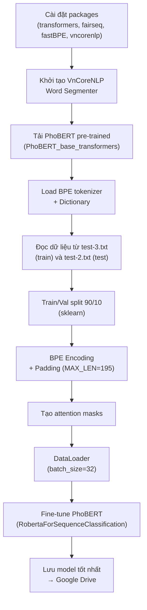

# Vietnamese Stock Article Classification — Repo Walkthrough

## Tổng quan / Overview

Repo này xây dựng một **mô hình phân loại tiêu đề bài báo chứng khoán tiếng Việt** sử dụng **PhoBERT** (mô hình BERT pre-trained cho tiếng Việt của VinAI). Mô hình phân loại tiêu đề thành **3 nhóm sentiment**:

| Label | Ý nghĩa | Ví dụ |
|-------|---------|-------|
| **1** → Negative | Tin tiêu cực cho thị trường | "Khối ngoại tiếp tục bán ròng gần 630 tỷ đồng" |
| **2** → Neutral | Tin trung lập, không ảnh hưởng | "Lịch sự kiện và tin vắn chứng khoán ngày 17/5" |
| **3** → Positive | Tin tích cực cho thị trường | "Vĩnh Hoàn (VHC): Doanh thu tháng 4 đạt 800 tỷ đồng" |

**Kết quả**: Đạt **accuracy ~93%** trên tập test.

---

## Cấu trúc Repo

```
Vietnamese-stock-article-classification/
├── README.md                        # Hướng dẫn sử dụng
├── Train.ipynb                      # Notebook huấn luyện mô hình (Google Colab)
├── Test.ipynb                       # Notebook inference/dự đoán
└── Dataset/
    ├── raw_data.xlsx                # Dữ liệu gốc (title + label)
    ├── Macp.xlsx                    # Danh sách mã cổ phiếu & tên công ty
    ├── Dataset_from_raw.ipynb       # Notebook tiền xử lý dữ liệu
    ├── test-2.txt                   # Tập test đã xử lý
    └── test-3.txt                   # Tập train đã xử lý (sau NER + preprocessing)
```

---

## Chi tiết từng file

### 1. `Dataset/raw_data.xlsx`
- Dữ liệu thô gồm **~1000 tiêu đề bài báo** lấy từ **CafeF.vn**
- 2 cột: `title` (tiêu đề gốc) và `label` (1/2/3)
- Phân bố: **187 negative**, **248 neutral**, **565 positive**

### 2. `Dataset/Macp.xlsx` 
- Danh sách mã chứng khoán Việt Nam (cột `Mã`) và tên công ty (cột `Tên Công ty`)
- Dùng trong bước tiền xử lý để nhận diện và thay thế tên riêng → `name`

### 3. `Dataset/Dataset_from_raw.ipynb` — Tiền xử lý dữ liệu

Notebook này biến đổi tiêu đề thô thành dạng chuẩn hóa cho PhoBERT. Quy trình:

```mermaid
flowchart TD
    A["raw_data.xlsx<br/>(tiêu đề gốc)"] --> B["VnCoreNLP NER<br/>(nhận diện thực thể)"]
    B --> C["Thay thế thực thể<br/>ORG/PER → 'name'<br/>LOC → 'loc'"]
    C --> D["Thay thế số liệu<br/>% → 'percent'<br/>ngày/tháng → 'date'<br/>số → 'number'"]
    D --> E["Loại bỏ dấu câu<br/>(. , : [ ] \" ...)"]
    E --> F["VnCoreNLP Word Segmenter<br/>(tách từ tiếng Việt)"]
    F --> G["Chuyển lowercase"]
    G --> H["test-3.txt<br/>(output chuẩn hóa)"]
```

**Ví dụ biến đổi:**
```
GỐC:    "FPT: Cổ phiếu bứt phá 59%, lãi ròng 4 tháng đầu năm tăng 20%"
SAU:    "name cổ_phiếu bứt_phá percent lãi_ròng date đầu năm tăng percent"
```

> [!IMPORTANT]
> Hàm `del_test()` là hàm chính cho preprocessing. Nó sử dụng **VnCoreNLP** (NER + word segmenter) nên cần Java runtime để chạy.

### 4. `Train.ipynb` — Huấn luyện mô hình

**Môi trường**: Google Colab với GPU

**Pipeline huấn luyện:**



**Các hyperparameter chính:**

| Parameter | Giá trị |
|-----------|---------|
| Model base | `PhoBERT_base` (RoBERTa architecture) |
| num_labels | 3 (negative, neutral, positive) |
| MAX_LEN | 195 tokens |
| batch_size | 32 |
| epochs | 5 |
| learning_rate | 5e-7 |
| optimizer | AdamW (with weight decay 0.01) |
| gradient clipping | max_norm = 1.0 |

**Metrics đánh giá**: Accuracy + F1-score (macro) trên cả train và validation set.

### 5. `Test.ipynb` — Inference / Dự đoán

Notebook để dùng model đã train để dự đoán sentiment cho tiêu đề mới:

1. Load model đã fine-tune từ Google Drive
2. Tiền xử lý tiêu đề đầu vào (cùng hàm `del_test()`)
3. BPE encode → padding → tạo mask
4. Chạy forward pass → `argmax` để lấy class

**Ví dụ dự đoán:**
```python
sent = 'VIC tăng mạnh, giá trị cổ phiếu tỷ phú Phạm Nhật Vượng nắm giữ đạt xấp xỉ 220.000 tỷ đồng'
predict(model, bpe, sent, vocab)  # → 2 (Neutral)
```

> [!NOTE]
> Kết quả output: `1` = Negative, `2` = Neutral, `3` = Positive (nhưng trong code train, label được shift `-1` nên index thực tế là 0/1/2).

---

## Tech Stack

| Thành phần | Công cụ |
|------------|---------|
| **Mô hình** | [PhoBERT](https://github.com/VinAIResearch/PhoBERT) (VinAI) — RoBERTa pre-trained cho tiếng Việt |
| **NLP tiếng Việt** | [VnCoreNLP](https://github.com/vncorenlp/VnCoreNLP) — NER + Word Segmentation |
| **Tokenizer** | fastBPE (Byte-Pair Encoding) |
| **Framework** | PyTorch + HuggingFace Transformers |
| **Data** | ~1000 tiêu đề từ CafeF.vn, gán nhãn bởi chuyên gia |
| **Môi trường** | Google Colab (GPU) |

---

## Lưu ý khi sử dụng

> [!WARNING]
> - Tất cả notebook thiết kế chạy trên **Google Colab** (paths `/content/...`, `drive.mount()`)
> - Cần tải **PhoBERT pre-trained** (~1.2GB) và **VnCoreNLP** (~200MB)
> - Model file (`.bin`) được lưu trên Google Drive, **không có sẵn trong repo**
> - Labels trong raw data là 1/2/3 nhưng **train code shift thành 0/1/2** (`train_labels[i] -= 1`)
